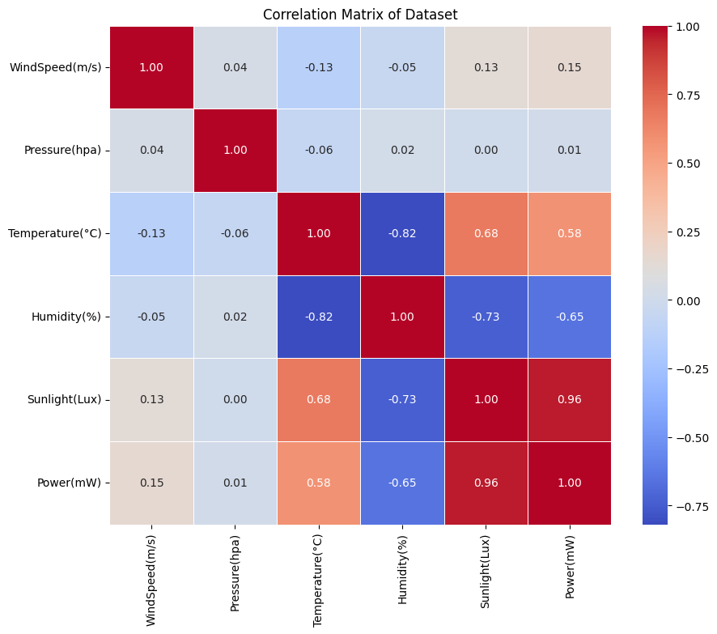

# LSTM預測-根據區域微氣候資料預測發電量

## 專案背景
- **競賽參與**: 參與T-Brain AI平台舉辦的「根據區域微氣候資料預測發電量競賽」，以真實數據進行模型訓練實作
- **數據來源**: 主辦方提供自行架設的太陽能板與感測器量測的發電量與天氣數據歷史資料作為訓練集 
- **預測目標**: 利用機器學習模型預測測試集中指定日期當天的太陽光裝置發電量
## 特徵與目標變量的相關性
透過繪製**關聯矩陣圖**觀察與計算資料集中的特徵`Features`與目標變量`Label`的相關性
- `Features`: 風速、大氣壓力、溫度、濕度、亮度
- `Label`: 太陽能板發電量


| 特徵        | 相關係數 | 解釋                    |
|-------------|----------|-------------------------|
| 光照度      | 0.96     | 對發電量預測最為關鍵    |
| 溫度        | 0.58     | 中等重要特徵，影響太陽能板效率 |
| 濕度        | -0.65    | 中等重要特徵，可能影響光照穿透率 |
| 風速        | 0.15     | 影響相對較小，可能影響散熱效果 |
| 大氣壓力    | 0.01     | 影響最小，與發電量關聯性不大 |


## 方法設計
- **資料預處理**: 對原始數據進行清洗、標準化和特徵工程，處理缺失值和異常值
- **LSTM模型訓練**: 使用LSTM神經網絡捕捉時間序列數據中的長期依賴關係，預測未來時間步的溫度、濕度和光照度
- **回歸模型建構**: 基於歷史數據，建立溫度、濕度、光照度與發電量之間的線性回歸模型
- **模型集成**: 將LSTM的預測結果作為回歸模型的輸入，生成最終的發電量預測值
- **模型評估與優化**: 使用評估指標(MSE)對模型進行評估，並通過調整超參數優化模型性能

## 基模型+微調策略
- **Base Model**: 以站點 17 的數據作為資料集，訓練一個基礎模型，該模型作為所有站點預測的初始模型
- **Fine-Tuning**: 根據其他站點的數據對基模型進行微調`Fine-Tuning`。使用分層微調方法，僅調整模型的後兩層權重（最後一層 LSTM 和輸出層），保留基層的通用特徵，為不同站點訓練微調的專門模型

## 資料預處理
```python
#設定LSTM往前看的筆數和預測筆數
LookBackNum = 12 #LSTM往前看的筆數
ForecastNum = 48 #預測筆數

#載入訓練資料
DataName = os.getcwd()+'\ExampleTrainData(AVG)\AvgDATA_17.csv'
SourceData = pd.read_csv(DataName, encoding='utf-8')

#迴歸分析 選擇要留下來的資料欄位
#(溫度,濕度,光照度)
#(發電量)
Regression_X_train = SourceData[['Temperature(°C)','Humidity(%)','Sunlight(Lux)']].values
Regression_y_train = SourceData[['Power(mW)']].values

#LSTM 選擇要留下來的資料欄位
#(溫度,濕度,光照度)
AllOutPut = SourceData[['Temperature(°C)','Humidity(%)','Sunlight(Lux)']].values

#正規化
LSTM_MinMaxModel = MinMaxScaler().fit(AllOutPut)
AllOutPut_MinMax = LSTM_MinMaxModel.transform(AllOutPut)
```
## 切割資料集
- 將原始數據切割為適合 LSTM 模型訓練的格式。
- 通過設定回看窗口`LookBackNum`，將資料集切割成等長的連續時間序列。每段時間序列作為輸入樣本`X_train`，對應時間序列後的下一個數據點作為標籤`y_train`
```python
X_train = []
y_train = []

#設定每i-12筆資料(X_train)就對應到第i筆資料(y_train)
for i in range(LookBackNum,len(AllOutPut_MinMax)):
  X_train.append(AllOutPut_MinMax[i-LookBackNum:i, :])
  y_train.append(AllOutPut_MinMax[i, :])


X_train = np.array(X_train)
y_train = np.array(y_train)

# Reshaping
#(samples 是訓練樣本數量,timesteps 是每個樣本的時間步長,features 是每個時間步的特徵數量)
X_train = np.reshape(X_train,(X_train.shape [0], X_train.shape [1], 3))
```
## 訓練Base Model
```python
#建置LSTM模型

regressor = Sequential ()

regressor.add(LSTM(units = 128, return_sequences = True, input_shape = (X_train.shape[1], 3)))

regressor.add(LSTM(units = 64))

regressor.add(Dropout(0.2))

# output layer
regressor.add(Dense(units = 3))
regressor.compile(optimizer = 'adam', loss = 'mean_squared_error')

#開始訓練
regressor.fit(X_train, y_train, epochs = 100, batch_size = 128)

#保存模型
from datetime import datetime
NowDateTime = datetime.now().strftime("%Y-%m-%dT%H_%M_%SZ")
regressor.save('WheatherLSTM_'+NowDateTime+'.h5')
print('Model Saved')
```
## 迴歸模型
利用線性迴歸計算 **Features** `溫度`、`濕度`、`亮度`與 **Label** `發電量`的線性關係
```python
#開始迴歸分析(對發電量做迴歸)
RegressionModel = LinearRegression()
RegressionModel.fit(LSTM_MinMaxModel.transform(Regression_X_train), Regression_y_train)

#儲存回歸模型
from datetime import datetime
NowDateTime = datetime.now().strftime("%Y-%m-%dT%H_%M_%SZ")
joblib.dump(RegressionModel, 'WheatherRegression_'+NowDateTime)

#取得截距
print('截距: ',RegressionModel.intercept_)

#取得係數
print('係數 : ', RegressionModel.coef_)

#取得R平方
print('R squared: ',RegressionModel.score(LSTM_MinMaxModel.transform(Regression_X_train), Regression_y_train))
```
- `截距`：表示在所有特徵值為 0 的情況下，模型預測的基準發電量
- `係數`：表示每個特徵對發電量的影響程度
- `R²`：表示模型對發電量變化的解釋能力。範圍為 [0, 1]，越接近 1，模型表現越好

## Fine-Tuning
- 載入先前訓練好的Base Model，針對各站點的資料微調模型
- 只解凍最後一層 LSTM 和輸出層目的是保持Base Model學到的基礎特徵不變，僅對模型高層進行微調
```python
# 檢查並建立模型存放資料夾
model_dir = './models'
if not os.path.exists(model_dir):
  os.makedirs(model_dir)

#為不同站點微調模型
def FineTune(LocationCode):
  # 格式化LocationCode為兩位數
  LocationCode = f'{int(LocationCode):02d}'

  # 載入預訓練模型
  regressor = load_model('WheatherLSTM_2024-11-14T19_55_11Z.h5')

  # 載入各站點的數據進行微調
  DataName = os.path.join(os.getcwd(), 'ExampleTrainData(AVG)', f'AvgDATA_{LocationCode}.csv')
  SourceData = pd.read_csv(DataName, encoding='utf-8')

  AllOutPut = SourceData[['Temperature(°C)', 'Humidity(%)', 'Sunlight(Lux)']].values

  # 正規化
  AllOutPut_MinMax = LSTM_MinMaxModel.transform(AllOutPut)

  # LSTM訓練資料構建
  X_train, y_train = [], []
  for i in range(LookBackNum, len(AllOutPut_MinMax)):
    X_train.append(AllOutPut_MinMax[i - LookBackNum:i, :])
    y_train.append(AllOutPut_MinMax[i, :])

  X_train, y_train = np.array(X_train), np.array(y_train)
  X_train = np.reshape(X_train, (X_train.shape[0], X_train.shape[1], 3))

  # 凍結基礎層，只解凍最後一層 LSTM 和輸出層
  for layer in regressor.layers[:-2]: 
    layer.trainable = False
  # 編譯模型並設定較低的學習率
  regressor.compile(optimizer=Adam(learning_rate=1e-5), loss='mean_squared_error')
  # 使用新的數據進行微調
  regressor.fit(X_train, y_train, epochs=10, batch_size=128)

  # 保存微調後的模型
  regressor.save(os.path.join(model_dir, f'WheatherLSTM_{LocationCode}.h5'))
  print(f'Model {LocationCode} Saved')

for i in range(1,18):
    FineTune(i)
```
## 模型預測
比賽題目為主辦方指定某站點的日期，透過當天該站點`7:00 ~ 9:00`的數據預測`9:00 ~ 17:00`之間每10分鐘的發電量，共預測48筆資料，題目總共200題，等同須預測9600筆資料
```python
# 載入測試資料
DataName = os.getcwd()+r'\ExampleTestData\upload.csv'
SourceData = pd.read_csv(DataName, encoding='utf-8')
target = ['序號']
EXquestion = SourceData[target].values

inputs = [] #存放參考資料
PredictOutput = [] #存放預測值(天氣參數)
PredictPower = [] #存放預測值(發電量) 
LookBackNum = 12  # LSTM往前看的筆數
ForecastNum = 48 #預測筆數

count = 0
while(count < len(EXquestion)):
  print('count : ',count)
  LocationCode = int(EXquestion[count])
  strLocationCode = f'{LocationCode:02d}'[-2:]

  # 根據編號載入指定的模型
  regressor = load_model(f'./models/WheatherLSTM_{strLocationCode}.h5')

  # 根據編號載入指定的資料集
  DataName = os.getcwd()+'\ExampleTrainData(IncompleteAVG)\IncompleteAvgDATA_'+ strLocationCode +'.csv'
  SourceData = pd.read_csv(DataName, encoding='utf-8') 
  ReferTitle = SourceData[['Serial']].values
  ReferData = SourceData[['Temperature(°C)','Humidity(%)','Sunlight(Lux)']].values

  inputs = []#重置存放參考資料

  #找到相同的一天，把12個資料都加進inputs
  for DaysCount in range(len(ReferTitle)):
    if(str(int(ReferTitle[DaysCount]))[:8] == str(int(EXquestion[count]))[:8]):
      TempData = ReferData[DaysCount].reshape(1,-1)
      TempData = LSTM_MinMaxModel.transform(TempData)
      inputs.append(TempData)
  #用迴圈不斷使新的預測值塞入參考資料，並預測下一筆資料
  for i in range(ForecastNum):

    #將新的預測值加入參考資料(用自己的預測值往前看)
    if i > 0 :
      inputs.append(PredictOutput[i-1].reshape(1,3))

    #切出新的參考資料12筆(往前看12筆)
    X_test = []
    X_test.append(inputs[0+i:LookBackNum+i])

    #Reshaping
    NewTest = np.array(X_test)
    NewTest = np.reshape(NewTest, (NewTest.shape[0], NewTest.shape[1], 3))

    predicted = regressor.predict(NewTest)
    PredictOutput.append(predicted)
    PredictPower.append(np.round(Regression.predict(predicted),2).flatten())
  
  #每次預測都要預測48個，因此加48個會切到下一天
  #0~47,48~95,96~143...
  count += 48

# 將預測結果寫成新的CSV檔案
# 將陣列轉換為 DataFrame
df = pd.DataFrame(PredictPower, columns=['答案'])

# 將 DataFrame 寫入 CSV 檔案
df.to_csv('output.csv', index=False) 
print('Output CSV File Saved')
```


